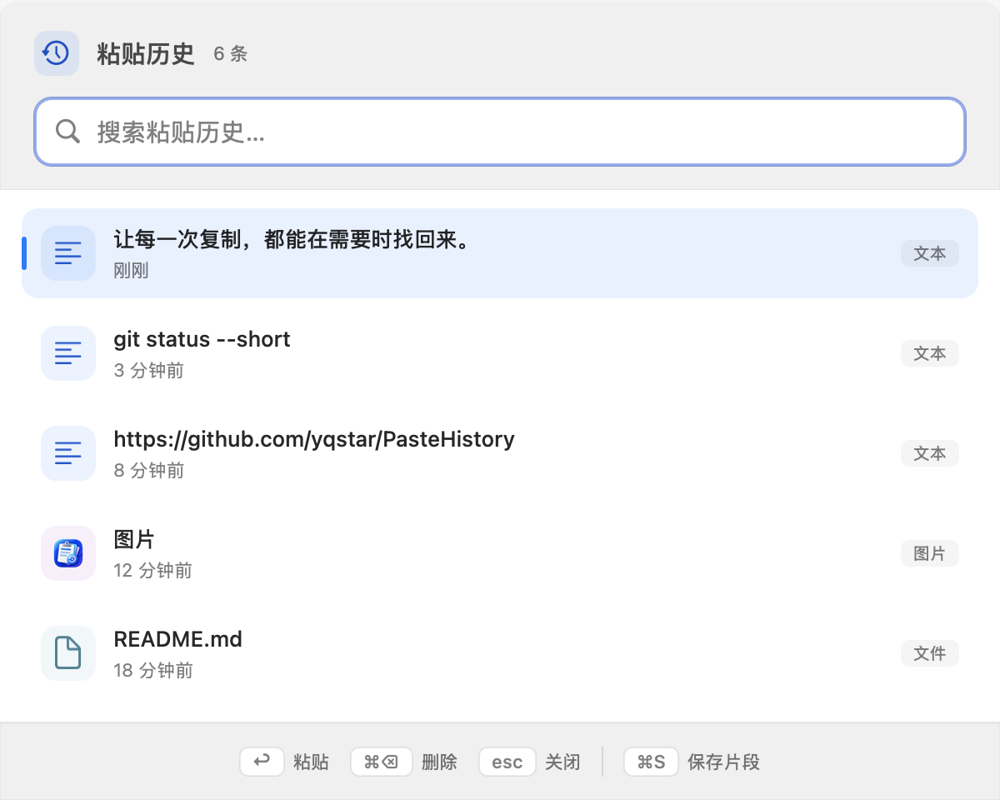
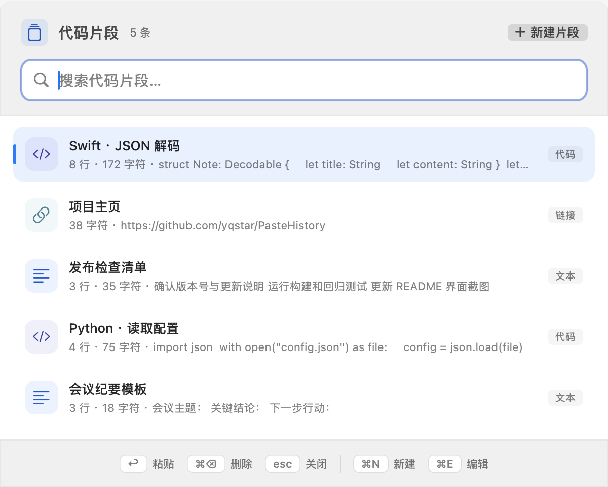
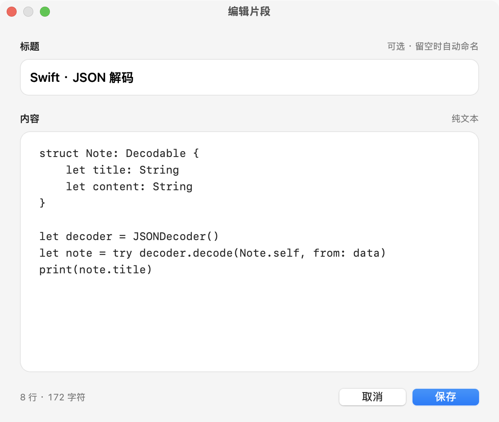
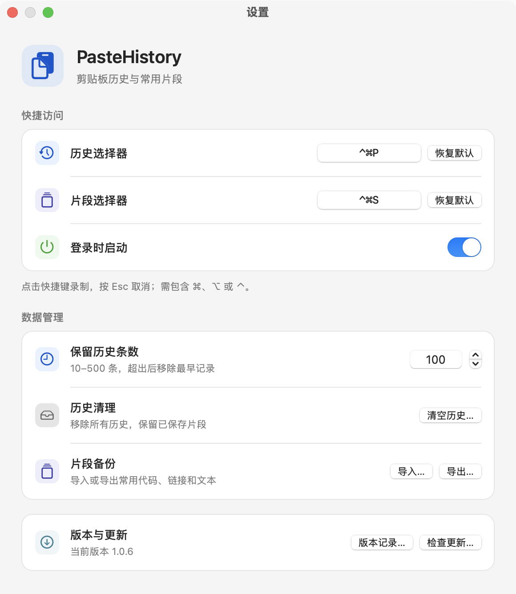

# PasteHistory · 粘贴历史

轻量、原生的 macOS 菜单栏剪贴板工具。记录文本、图片和文件路径，将常用代码、链接和文字存为片段，随时搜索并粘贴。所有内容仅保存在本机。

[](https://github.com/yqstar/PasteHistory/releases/latest)


[下载最新版](https://github.com/yqstar/PasteHistory/releases/latest) · [版本记录](CHANGELOG.md) · [开发说明](docs/DEVELOPMENT.md)

<p align="center">
  <picture>
    <source media="(prefers-color-scheme: dark)" srcset="docs/screenshots/history-dark.png">
    
  </picture>
</p>

<p align="center">⌃⌘P 打开历史 → 输入关键词 → Return 粘贴</p>

## 开始使用

1. 从 [最新 Release](https://github.com/yqstar/PasteHistory/releases/latest) 下载 Universal DMG，打开后将“粘贴历史”拖入 `Applications`。
2. 启动应用，菜单栏会出现剪贴板图标。应用不会显示在 Dock 中。
3. 在“系统设置 → 隐私与安全性 → 辅助功能”中允许“粘贴历史”，即可自动粘贴；未授权时，选中内容后可手动按 `⌘V`。

支持 macOS 13 及以上、Apple Silicon 和 Intel。当前安装包使用 ad-hoc 签名，尚未经过 Apple 公证；首次启动如被拦截，请在系统设置的“隐私与安全性”中查看并允许打开。

## 常用快捷键

| 操作 | 快捷键 |
| --- | --- |
| 打开历史 / 片段选择器 | `⌃⌘P` / `⌃⌘S` |
| 选择内容 / 粘贴 | `↑` `↓` / `Return` |
| 关闭选择器 | `Esc` |
| 删除选中项 | `⌘⌫` |
| 将选中的文本历史保存为片段 | `⌘S` |
| 新建 / 编辑片段 | `⌘N` / `⌘E` |

片段支持按标题和正文搜索。新建时标题可留空，关闭未保存的编辑会提示保存或放弃。

<details>
<summary>查看片段选择器与编辑器</summary>

<p align="center">
  <picture>
    <source media="(prefers-color-scheme: dark)" srcset="docs/screenshots/snippets-dark.png">
    
  </picture>
</p>
<p align="center">
  <picture>
    <source media="(prefers-color-scheme: dark)" srcset="docs/screenshots/editor-dark.png">
    
  </picture>
</p>

</details>

## 设置

从菜单栏打开“设置…”（`⌘,`）：

- **快捷访问**：修改两个全局快捷键，设置登录时启动。
- **数据管理**：调整历史保留条数（默认 100，可设 10–500）、清空历史、导入或导出片段。
- **版本与更新**：查看本地版本记录，手动检查并下载新版。

<p align="center">
  <picture>
    <source media="(prefers-color-scheme: dark)" srcset="docs/screenshots/settings-dark.png">
    
  </picture>
</p>

截图使用当前源码和示例数据，随页面主题切换浅色或深色版本。

## 数据与隐私

历史、片段及图片位于 `~/Library/Application Support/PasteHistory/`，以明文保存在本机，不会上传。清空历史不会删除已保存片段；复制过的敏感内容请及时清理。

应用仅在手动检查更新时请求 GitHub，不发送剪贴板或片段内容，不自动安装更新。下载新版后退出应用、替换安装即可，原有数据保留。

## 从源码构建

需要 Xcode Command Line Tools（`xcode-select --install`），无第三方依赖。

```bash
git clone https://github.com/yqstar/PasteHistory.git
cd PasteHistory
bash build.sh
open build/PasteHistory.app
```

测试、截图生成、DMG 打包、数据格式和发布流程见 [开发说明](docs/DEVELOPMENT.md)。
