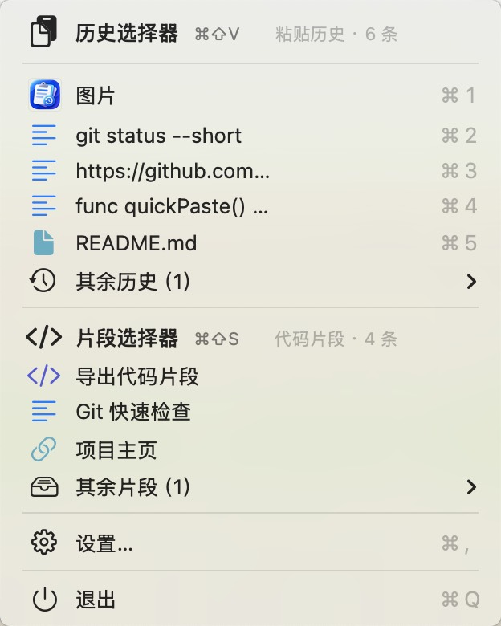

# PasteHistory · 粘贴历史

一个轻量、原生的 macOS 菜单栏剪贴板历史工具。使用 AppKit / Swift 编写，无第三方依赖；文本、图片、文件路径和代码片段均只保存在本地。

[](https://github.com/yqstar/PasteHistory/releases/latest)


[下载最新版本](https://github.com/yqstar/PasteHistory/releases/latest) · [从源码构建](#从源码构建) · [查看全部 Releases](https://github.com/yqstar/PasteHistory/releases)

## 界面预览

<p align="center">
  
</p>

<p align="center">最近 5 条历史与最近 3 条片段直接显示，其余内容按需展开。</p>

## 下载与安装

### 从 Release 下载（推荐）

1. 打开 [最新 Release](https://github.com/yqstar/PasteHistory/releases/latest)。
2. 下载 `PasteHistory-x.y.z-universal.dmg`。
3. 打开 DMG，将“粘贴历史”拖入 `Applications`。
4. 启动后，菜单栏右上角会出现剪贴板图标；应用不会显示在 Dock 中。

Release 中的 Universal 版本同时支持 Apple Silicon 和 Intel Mac，最低系统版本为 macOS 13。

> 当前发布包使用 ad-hoc 签名，尚未经过 Apple 公证。首次启动若出现“无法验证开发者”，可在 Finder 中右键应用并选择“打开”，再确认启动。

### 从源码构建

需要先安装 Xcode Command Line Tools：

```bash
xcode-select --install
```

克隆并构建：

```bash
git clone https://github.com/yqstar/PasteHistory.git
cd PasteHistory
./build.sh
open build/PasteHistory.app
```

构建产物为 `build/PasteHistory.app`，包含应用图标，并同时支持 `arm64` 和 `x86_64`。

如需自行生成 DMG：

```bash
./make-dmg.sh
```

产物位于 `build/PasteHistory.dmg`。

## 功能

- **自动记录剪贴板**：支持文本、图片和文件路径，重复文本或文件只移动到最前，不重复新增。
- **历史选择器**：默认按 `⌘⇧V` 唤出；直接输入关键字搜索，支持拼音匹配。
- **代码片段选择器**：默认按 `⌘⇧S` 唤出，可按标题或内容搜索常用代码、链接和文本。
- **键盘优先**：使用 `↑` / `↓` 选择，`Return` 粘贴，`⌘⌫` 删除，`Esc` 关闭；片段选择器还支持 `⌘E` 编辑。
- **自动粘贴**：选中内容后写回系统剪贴板，并自动向之前使用的 App 发送 `⌘V`。
- **菜单栏快捷访问**：显示最近 5 条历史和最近 3 条片段，历史项支持 `⌘1`–`⌘5` 快捷选择，其余内容使用懒加载子菜单。
- **片段管理**：在设置中保存新片段，并支持 JSON 导入、导出；导入时可按 UUID 合并或替换全部。
- **可配置设置**：自定义两个选择器的全局快捷键、历史保留条数和开机自启动。
- **本地持久化**：所有数据保存在 `~/Library/Application Support/PasteHistory/`，应用不联网。

## 使用方法

### 历史选择器

1. 在任意 App 中复制文本、图片或文件。
2. 按 `⌘⇧V` 打开历史选择器。
3. 输入关键字过滤，使用方向键选择。
4. 按 `Return` 写回剪贴板并自动粘贴。

### 片段选择器

在菜单栏中可以直接使用最近片段，也可以按 `⌘⇧S` 打开完整片段选择器。片段粘贴不会被再次记录进剪贴板历史。

新建、导入和导出片段的位置：

```text
菜单栏 → 设置… → 数据管理 → 代码片段
```

### 修改快捷键

两个选择器的快捷键都可以在以下位置修改：

```text
菜单栏 → 设置…（⌘,）→ 快捷键
```

- 点击快捷键按钮后，按下新的组合键即可立即保存。
- 组合键至少需要包含 `⌘`、`⌥` 或 `⌃` 之一；录制时按 `Esc` 取消。
- 如果组合已被其他程序占用，应用会保留原快捷键并提示更换。
- “恢复默认”可分别恢复为 `⌘⇧V` 和 `⌘⇧S`。

## 权限说明

监听系统剪贴板本身不需要额外权限。自动粘贴通过模拟 `⌘V` 完成，需要在以下位置允许“粘贴历史”使用辅助功能：

```text
系统设置 → 隐私与安全性 → 辅助功能
```

未授权时，选中的内容仍会写入系统剪贴板，可以手动按 `⌘V` 粘贴。

## 数据位置

```text
~/Library/Application Support/PasteHistory/
├── history.json      # 文本、文件路径和图片元数据
├── snippets.json     # 已保存的代码片段
└── images/           # 剪贴板图片（PNG）
```

- 历史记录默认保留 100 条，可在设置中调整为 10–10000 条。
- 清空历史请使用“设置… → 数据管理 → 清空历史…”，该操作不会删除已保存片段。
- 数据以明文保存在本机；如果复制过密码或其他敏感信息，请及时清理历史。

## 代码片段格式

`snippets.json` 是一个 JSON 数组：

```json
[
  {
    "id": "11111111-2222-3333-4444-555555555555",
    "title": "邮箱签名",
    "content": "Best,\n张三",
    "hotKey": {
      "keyCode": 18,
      "carbonModifiers": 2304,
      "display": "⌥⌘1"
    }
  }
]
```

- `id` 为 UUID。
- `title` 和 `content` 分别是片段标题与实际粘贴内容。
- `hotKey` 可省略；设置后可以用独立全局快捷键直接粘贴该片段。
- 直接编辑 JSON 后需要重启应用；日常使用建议通过设置中的导入、导出功能管理。

## 自动发布

项目使用 [GitHub Actions](.github/workflows/release.yml) 自动构建 Release。推送符合 `vMAJOR.MINOR.PATCH` 格式的标签后，工作流会：

1. 构建 Apple Silicon 与 Intel 双架构应用。
2. 校验应用签名与 DMG。
3. 生成带版本号的 Universal DMG 和 SHA-256 文件。
4. 创建 GitHub Release 并自动生成更新说明。

发布示例：

```bash
git tag -a v1.0.1 -m "PasteHistory v1.0.1"
git push origin v1.0.1
```

## 说明

- 应用仅监听通用剪贴板 `NSPasteboard.general`，根据活跃程度以 0.3–2 秒间隔动态轮询。
- 全局快捷键使用 Carbon `RegisterEventHotKey` 注册。
- 当前版本没有 Apple Developer ID 签名和公证；如需正式公开分发，建议在 Release 工作流中补充签名、公证和 stapling。
